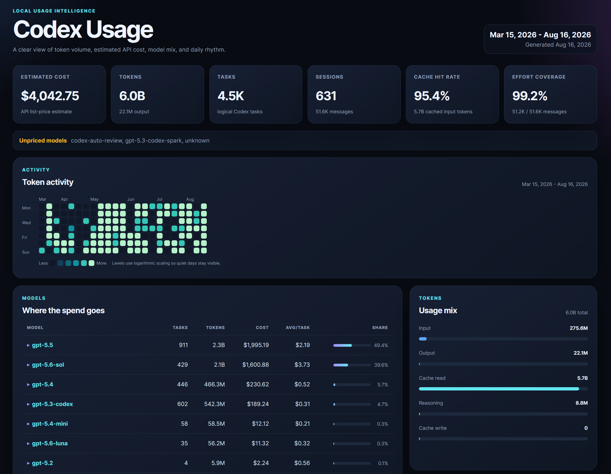

# Codex Usage Cost

There are plenty of LLM benchmarks, but they do not show how much different models cost for your own work. Codex Usage Cost uses your real Codex sessions to give you a precise view of model costs across your tasks.

Generate a private, self-contained HTML dashboard from your local Codex session logs. Compare token usage, estimated API costs, models, and reasoning-effort levels without uploading prompts or responses. The tool is local-first and dependency-free at runtime: it reads JSONL logs from your machine and writes reports to your machine.



## What it shows

- Token and estimated API cost totals by day and model
- Expandable effort-level statistics for each model
- Tasks, sessions, messages, cache reads, and cache-hit rate
- A GitHub-style activity heatmap and recent daily activity
- Portable aggregate exports for combining usage from multiple devices
- JSON and terminal views for scripts and quick checks

Cost is an estimate based on the bundled public API price catalog. It is not a Codex subscription bill or a credits calculation.

## Quick start

Requires Python 3.10 or newer. Clone the repository, create a virtual environment, and install it locally.

### Windows PowerShell

```powershell
git clone https://github.com/AlexMerzlikin/codex-usage-cost.git
Set-Location codex-usage-cost
py -3 -m venv .venv
.\.venv\Scripts\Activate.ps1
py -m pip install .
codex-usage-cost
```

If PowerShell blocks activation, skip it and use the environment directly:

```powershell
.\.venv\Scripts\python.exe -m pip install .
.\.venv\Scripts\python.exe -m codex_usage_cost
```

### macOS and Linux

```bash
git clone https://github.com/AlexMerzlikin/codex-usage-cost.git
cd codex-usage-cost
python3 -m venv .venv
source .venv/bin/activate
python3 -m pip install .
codex-usage-cost
```

The default command opens no network connections. It writes a dated report to:

```text
output/codex-usage-cost-report-YYYY-MM-DD.html
```

Open that file in any modern browser.

## Finding Codex data

The tool checks these locations automatically:

1. `$CODEX_HOME/sessions` and `$CODEX_HOME/archived_sessions`, when `CODEX_HOME` is set
2. `~/.codex/sessions` and `~/.codex/archived_sessions` otherwise

Use `--path` to read a specific JSONL file or directory. Repeat the option to combine several locations:

```powershell
codex-usage-cost --path "E:\Codex\sessions"
```

`--home` is retained for fixtures and legacy layouts; it expects a `.codex` directory inside the supplied home path.

## Common commands

```bash
# Default HTML dashboard
codex-usage-cost

# Choose the report path
codex-usage-cost --html reports/tokens.html

# Limit the date range
codex-usage-cost --since 2026-08-01 --until 2026-08-31

# Machine-readable output
codex-usage-cost --json

# Interactive terminal dashboard
codex-usage-cost --tui

# Show every option
codex-usage-cost --help
```

You can also run the package without the installed command:

```bash
python -m codex_usage_cost
```

## Combine multiple devices

Export aggregate usage on one machine:

```bash
codex-usage-cost --device-name laptop --export-report laptop.json
```

Import it on another machine alongside local sessions:

```bash
codex-usage-cost --import-report laptop.json
```

Portable exports contain token counters, model/provider, timestamps, effort, task boundaries, and aggregate report data. They do not contain prompts, responses, workspace paths, or source file paths. Duplicate events are counted once when overlapping exports are imported.

## How cost and tasks are calculated

Reasoning tokens use the model's output rate. Cached input is separated from ordinary input. Unknown models remain visible but receive a zero estimate instead of being matched heuristically.

A task is a session's first usage segment plus each later user-message turn. A task can appear under more than one model if the model changes during that turn. Effort comes from the session turn context; missing values are grouped as `Unknown`.

## Development

Install in editable mode and run the standard-library test suite:

```bash
python -m pip install -e .
python -m unittest discover -s tests -p "test_*.py"
```

The project intentionally has no runtime dependencies. Please keep changes focused, add a regression test for behavior changes, and avoid including real session logs in issues or pull requests.

## Privacy and security

The tool does not log in, upload data, or fetch pricing. Review portable JSON exports before sharing them and report security concerns privately to the repository owner rather than posting sensitive logs in a public issue.

## Attribution and license

The Codex session parser behavior is adapted from [Tokscale](https://github.com/junhoyeo/tokscale) by Junho Yeo. See [NOTICE](NOTICE) for upstream attribution.

This project is available under the [MIT License](LICENSE).
